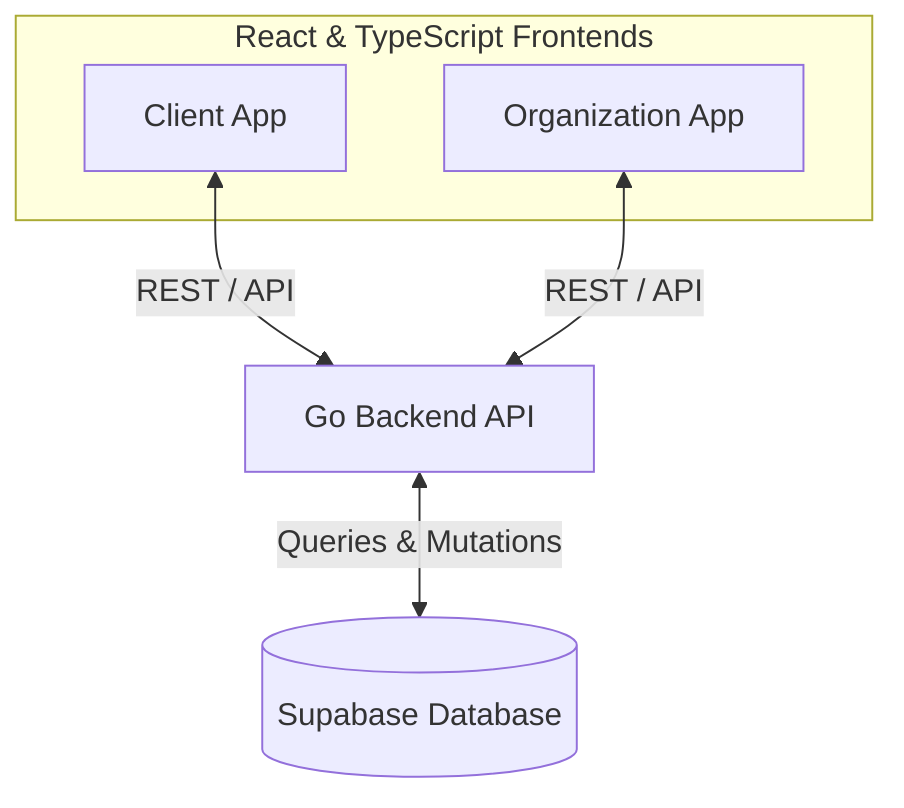

# Potero Frontend Client

This is the frontend client for Potero, built with React, Vite, and Tailwind CSS. 

## Live Demo

The live demo can be accessed at: [https://qapp-fe-client.onrender.com/](https://qapp-fe-client.onrender.com/)

## About This Project

This project serves a few different purposes:

- **Hobby to Enterprise:** What started as a hobby project is designed with enterprise-level scaling, architecture, and best practices in mind.
- **AI-Assisted Development ("Vibe Coded"):** While the majority of the code generation was heavily assisted by AI (vibe coded), the core planning, structural decisions, component architecture, and overall product direction were strictly guided and maintained by me.
## Architecture

---

*Note: Local development and setup instructions are not provided in this repository, as the backend services and databases required for this project are not exposed to the public.*